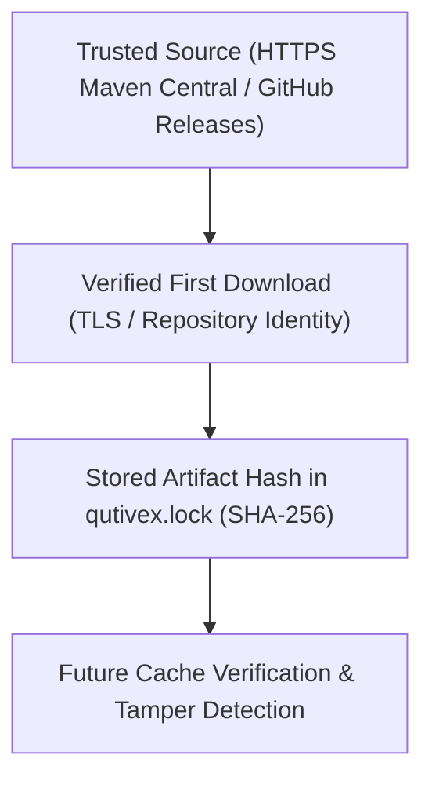

# Security, Integrity & Bootstrap Trust Model

This document outlines the security architecture, bootstrap trust model, and integrity verification guarantees of Qutivex.

---

## 1. Core Trust Model

An essential distinction in package manager security:
> **A cryptographic SHA-256 hash generated after downloading a file proves that future files are unchanged (change detection and cache integrity). It does not prove that the initial download was untampered unless anchored to a trusted source.**

Qutivex implements a **Trust-On-First-Use (TOFU)** bootstrap model coupled with strict, immutable verification:



### Precise Terminology
- **Integrity Verification**: Calculating the SHA-256 cryptographic digest of a local or cached file and verifying that it strictly matches the expected digest recorded in `qutivex.lock`.
- **Trusted Bootstrap**: Securely anchoring initial component acquisition via authenticated TLS channels and verified repository endpoints.
- **Repository Identity**: Enforcing that all dependency resolution and package fetching query only declared, trusted HTTPS repositories (default: `https://repo.maven.apache.org/maven2/`).
- **Checksum Verification**: Validating binary payloads against cryptographically secure SHA-256 digests before execution or packaging.

---

## 2. Component Security Specifications

### A. Qutivex Installer & Self-Update (`qutivex-x64.msi`)
- **Distribution**: Every official release on GitHub Releases publishes the binary installer along with an accompanying SHA-256 digest file:
  - `qutivex-x64.msi`
  - `qutivex-x64.msi.sha256`
- **Verification**: Users and automated provisioning pipelines verify installer integrity before execution:
  ```powershell
  $actual = (Get-FileHash -Algorithm SHA256 .\qutivex-x64.msi).Hash.ToLower()
  $expected = (Get-Content .\qutivex-x64.msi.sha256).Split(" ")[0].ToLower()
  if ($actual -ne $expected) { throw "Installer checksum mismatch!" }
  ```
- **Self-Update Security (`qutivex update`)**:
  - The CLI self-updater fetches release manifests strictly over HTTPS from GitHub Releases API (`babar-xagi/Qutivex`).
  - Downloads the release MSI and its corresponding `.sha256` checksum file.
  - Computes the SHA-256 digest of the downloaded MSI locally using streaming hashing.
  - If the computed digest does not match the published release checksum, the downloaded installer is immediately deleted and the upgrade is aborted with a `SecurityException`.
  - Upgrades are launched via `msiexec.exe /i <msi> /qb`, ensuring Windows Installer manages transaction logging, component registration, and permissions. Qutivex **never** manually overwrites files in `C:\Program Files\`.

### B. Managed Backend (Build/Run/Test Only)
- **Pinned Version**: The disposable Gradle backend (used temporarily only for `run`, `test`, `build` until Phase 4) is pinned to version `9.5.0`.
- **Distribution Integrity**:
  - The wrapper configuration (`.qutivex/gradle/gradle/wrapper/gradle-wrapper.properties`) is pinned to HTTPS distribution URLs.
  - The binary wrapper JAR (`gradle-wrapper.jar`) is embedded within the Qutivex distribution and verified before execution.
  - In `qutivex.lock`, the `[backend]` section records the exact type and version:
    ```toml
    [backend]
    type = "gradle"
    gradle = "9.5.0"
    ```
- **Zero Gradle in Dependency Lifecycle**: No Gradle process is launched during `add`, `remove`, `update`, `list`, `tree`, `install`, `install --offline`, or `install --frozen`.

### C. Maven Artifacts
- **Repository Identity**: All remote artifact queries use HTTPS to Maven Central.
- **Transitive Checksum Storage**:
  - Upon first successful resolution, the SHA-256 digest of every resolved direct and transitive JAR/POM is recorded in `qutivex.lock`.
- **Tampered Artifact Rejection**:
  - Before using or verifying cached artifacts, Qutivex re-computes the SHA-256 digest of the local file.
  - If a cached artifact's bytes have been modified or corrupted, Qutivex rejects the artifact immediately:
    ```text
    error: Artifact integrity verification failed.

    Artifact:
    org.jetbrains.kotlinx:kotlinx-coroutines-core-jvm:1.10.2

    Expected SHA-256:
    5ca175...

    Actual SHA-256:
    9f08ab...

    The cached artifact may be corrupted or modified.
    ```
- **Frozen Invariance**:
  - In `--frozen` mode, Qutivex never rewrites or updates integrity hashes. If any mismatch is detected, execution aborts with a non-zero exit code.

### D. Kotlin Toolchain
- **Pinned Compiler**: Projects explicitly pin their Kotlin compiler version (e.g. `2.4.10`) and JVM bytecode target (e.g. `21`) in `qutivex.toml`.
- **Lockfile Enforcement**:
  - `qutivex.lock` records `kotlin` and `jvm` in the `[toolchain]` section.
  - In `--frozen` mode, any drift between `qutivex.toml`, runtime environment, and `qutivex.lock` triggers an immediate error.

### E. Lockfile Immutability
- In `--frozen` mode (`qutivex install --frozen` and `qutivex install --offline --frozen`):
  - `qutivex.toml` is read-only.
  - `qutivex.lock` is read-only.
  - No checksums or hashes are ever updated or recalculated during frozen verification.

---

## 3. Mutual Exclusion & Project Mutation Locking

To prevent race conditions, partial writes, or file corruption during concurrent operations:
- All mutating commands (`add`, `remove`, `install`) acquire an exclusive project lock (`.qutivex/project.lock`).
- The lock file records:
  - `pid`: Process ID of the holding process.
  - `operation`: Name of the active command (e.g., `add`, `remove`, `install`).
  - `timestamp`: System timestamp of lock acquisition.
- If another process attempts to mutate the project concurrently, it aborts cleanly with:
  ```text
  error: Another Qutivex operation is currently modifying this project.

  Process: 12345
  Operation: install

  Wait for it to finish and retry.
  ```
- **Stale Lock Recovery**: If a process crashes while holding the lock, subsequent Qutivex operations check whether the recorded PID is still alive using the operating system process handle. If the process is dead, the stale lock is automatically cleared and execution proceeds safely.
